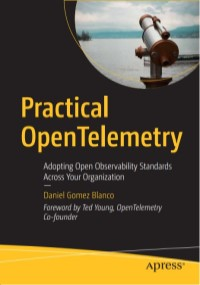

# Apress Source Code

This repository accompanies [Practical OpenTelemetry: Adopting Open Observability Standards Across Your Organization](https://www.link.springer.com/book/10.1007/9781484290743)
by Daniel Gomez Blanco (Apress, 2023).

[comment]: #cover


Download the files as a zip using the green button, or clone the repository to your machine using Git.

## Scope

As mentioned within the introduction, most code snippets in the book are meant
to be considered in isolation to illustrate the concepts discussed in each chapter. The intention is not to create yet
another full-fledged OpenTelemetry demo environment, so their source code has not been made available in this repo. This
is intentional, as OpenTelemetry provides its official OpenTelemetry Demo (available at
https://github.com/open-telemetry/opentelemetry-demo) for this purpose, which allows users to work with OpenTelemetry
instrumented services and visualise the telemetry produced in the observability platform of their choice.

However, *Chapter 4* demonstrates the power of standard instrumentation to automatically generate and export telemetry
from within an existing Java application that has not been previously instrumented with OpenTelemetry. The resources in
this project will make it easy for readers to stand up the examples described in this chapter.

## Installation

This project relies on GNU Make, Git, Java and Docker to run the `dropwizard-example` application, available at
https://github.com/dropwizard/dropwizard. It has been tested with the following versions:

* MacOs Monterrey 12.5.1
* GNU Make 3.81
* Git 2.39.0
* curl 7.79.1
* Docker 20.10.20
* OpenJDK 17

The application and the (minimal) telemetry stack this application spins up consists of:

* Dropwizard v2.1.1
* OpenTelemetry Java Agent 1.21.0
* OpenTelemetry Collector (Contrib) 0.64.0
* Prometheus 2.38.0
* Jaeger (All-in-One Distro) 1.37.0

To install and build the necessary resources:

```shell
make
```

This will clone and build the `dropwizard-example` application. Even though tests are skipped to speed the process, this
Maven build can still a little while to complete (the intention is not to deviate from the `dropwizard-example` build
instructions). This step will also initialise the in-memory database, download the OpenTelemetry Java Agent and build
our `cache-client-extension` processor. It is also possible to execute these steps individually as defined in the
`Makefile`.

Any changes to source code will be automatically rebuilt by running `make` again without the need to delete any
resources. However, to clean up all build artefacts generated by this process, you can run:

```shell
make clean
```

In addition to deleting build artefacts, this command will also delete any stopped Docker containers.

## Running the application
The `Makefile` provides a simple way to run the application in multiple modes, including the snippets in described in
the book:

```shell
# Run the application without OpenTelemetry instrumentation
make run-without-otel

# Run the application with OpenTelemetry instrumentation
make run-app

# Stand up Docker Compose stack with OpenTelemetry Collector, Prometheus and Jaeger
make run-stack

# Run app with OpenTelemetry instrumentation  (logs will be produced in the same terminal)
make run-all

# Run app using the cache-client-extension SpanProcessor
make run-app-with-extension

# Run app using the cache-client-extension SpanProcessor and telemetry stack in parallel
make run-all-with-extension
```

As mentioned in Chapter 4, running `dropwizard-example` will generate some `WARN` level logs, as the application comes
pre-configured to push metrics to Graphite, which we won't use in this example. The following links, also cited in
Chapter 4, can be used to send some requests to the application and to evaluate the telemetry produced:

* http://localhost:8080/hello-world: Welcome message from `dropwizard-example`.
* http://localhost:9090: Prometheus web interface, to visualise metrics (with exemplars) produced.
* http://localhost:16686: Jaeger UI, to examine traces for operations being handled by our application.

To interact with the database, as detailed in the example illustrated in Figure 4-2, you can send a request to the
`/people` endpoint as follows:

```shell
curl -H "Content-Type: application/json" -X POST \
  -d '{"fullName":"Other Person","jobTitle":"Other Title"}' \
  http://localhost:8080/people
```

Navigating to http://localhost:8080/people will show the records currently present in the database.

To showcase the concepts in _Chapter 8 - Logs_, this project also provides the following commands:

```shell
# Run app exporting logs in OTLP to the default OpenTelemetry Collector address 
make run-app-with-logs

# Run app exporting logs in OTLP and telemetry stack in parallel
make run-all-with-logs
```

In addition to configure the application to export logs via OTLP, this will use a modified `example.yml` Dropwizard
config file called `chapter8.example.yml` which showcases OpenTelemetry instrumentation adding attributes to the default
`console` logger, as discussed in _Chapter 8 - Logs_. Navigating to
http://localhost:8080/hello-world/date?date=2023-01-15 will generate a request that showcases the use of MDC
instrumentation to annotate log lines with the trace and span ID corresponding to the given request.

## Releases

Release v1.0 corresponds to the code in the published book, without corrections or updates.

## Contributions

See the file Contributing.md for more information on how you can contribute to this repository.